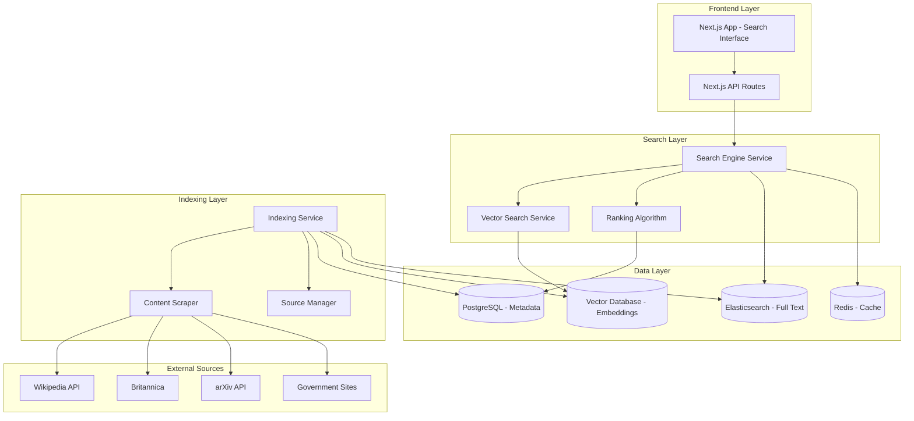

# Design Document

## Overview

The Trusted Search Engine is a production-ready web application built on Next.js 15 that provides Google-like search functionality while restricting results to verified, high-authority sources. The system combines modern web technologies with advanced search algorithms, semantic understanding, and robust indexing capabilities to deliver reliable, credible search results.

The architecture follows a microservices approach with clear separation between the frontend interface, search API, indexing service, and data storage layers. The system leverages Next.js App Router for the frontend, implements semantic search using embeddings and vector databases, and maintains a curated index of trusted sources.

## Architecture

### High-Level Architecture



### Technology Stack

- **Frontend**: Next.js 15 with React 19, TypeScript, Tailwind CSS v4
- **Backend**: Next.js API Routes, Node.js runtime
- **Search Engine**: Elasticsearch for full-text search, Pinecone/Weaviate for vector search
- **Database**: PostgreSQL for metadata, Redis for caching
- **AI/ML**: OpenAI/Anthropic APIs for embeddings, Hugging Face transformers for local NLP
- **Deployment**: Vercel for frontend, Railway/Render for backend services

## Components and Interfaces

### Frontend Components

#### SearchInterface Component
- **Purpose**: Main search input and results display
- **Props**: `initialQuery?: string`, `filters?: SearchFilters`
- **State**: Query string, loading state, results, active filters
- **Features**: Auto-complete, query suggestions, real-time search

#### SearchResults Component
- **Purpose**: Display paginated search results with metadata
- **Props**: `results: SearchResult[]`, `totalCount: number`, `currentPage: number`
- **Features**: Result snippets, source badges, pagination, infinite scroll option

#### FilterPanel Component
- **Purpose**: Advanced search filters sidebar
- **Props**: `availableFilters: FilterOptions`, `activeFilters: SearchFilters`
- **Features**: Source type filters, date range picker, topic categories

#### ResultCard Component
- **Purpose**: Individual search result display
- **Props**: `result: SearchResult`
- **Features**: Title, snippet, source info, relevance score, direct link

### Backend Services

#### SearchService
```typescript
interface SearchService {
  search(query: string, filters: SearchFilters): Promise<SearchResponse>
  getSuggestions(partialQuery: string): Promise<string[]>
  getRelatedQueries(query: string): Promise<string[]>
}
```

#### IndexingService
```typescript
interface IndexingService {
  indexSource(sourceConfig: SourceConfig): Promise<void>
  updateIndex(sourceId: string): Promise<void>
  removeFromIndex(sourceId: string): Promise<void>
  getIndexStatus(): Promise<IndexStatus>
}
```

#### SourceManager
```typescript
interface SourceManager {
  addTrustedSource(source: TrustedSource): Promise<void>
  removeTrustedSource(sourceId: string): Promise<void>
  validateSource(url: string): Promise<ValidationResult>
  getTrustedSources(): Promise<TrustedSource[]>
}
```

### API Endpoints

#### Search API
- `GET /api/search?q={query}&filters={filters}&page={page}` - Main search endpoint
- `GET /api/search/suggestions?q={partial}` - Query auto-complete
- `GET /api/search/related?q={query}` - Related query suggestions

#### Admin API
- `POST /api/admin/sources` - Add trusted source
- `DELETE /api/admin/sources/{id}` - Remove trusted source
- `POST /api/admin/reindex` - Trigger re-indexing
- `GET /api/admin/status` - System health and index status

## Data Models

### Core Data Models

#### SearchResult
```typescript
interface SearchResult {
  id: string
  title: string
  snippet: string
  url: string
  source: SourceInfo
  relevanceScore: number
  publishedDate?: Date
  lastUpdated: Date
  topics: string[]
  contentType: 'article' | 'paper' | 'document' | 'page'
}
```

#### SourceInfo
```typescript
interface SourceInfo {
  id: string
  name: string
  type: 'wikipedia' | 'academic' | 'government' | 'encyclopedia'
  domain: string
  authorityScore: number
  trustLevel: 'high' | 'verified' | 'institutional'
}
```

#### TrustedSource
```typescript
interface TrustedSource {
  id: string
  name: string
  baseUrl: string
  type: SourceType
  apiEndpoint?: string
  crawlConfig: CrawlConfig
  authorityScore: number
  isActive: boolean
  lastIndexed?: Date
}
```

#### SearchFilters
```typescript
interface SearchFilters {
  sourceTypes?: SourceType[]
  dateRange?: {
    start: Date
    end: Date
  }
  topics?: string[]
  contentTypes?: ContentType[]
  minAuthorityScore?: number
}
```

### Database Schema

#### PostgreSQL Tables
- `trusted_sources` - Source configuration and metadata
- `indexed_content` - Content metadata and indexing status
- `search_analytics` - Query logs and performance metrics
- `user_sessions` - Session tracking for personalization

#### Elasticsearch Index Structure
```json
{
  "mappings": {
    "properties": {
      "title": {"type": "text", "analyzer": "standard"},
      "content": {"type": "text", "analyzer": "standard"},
      "url": {"type": "keyword"},
      "source_id": {"type": "keyword"},
      "published_date": {"type": "date"},
      "topics": {"type": "keyword"},
      "authority_score": {"type": "float"}
    }
  }
}
```

## Error Handling

### Frontend Error Handling
- **Network Errors**: Retry mechanism with exponential backoff
- **Search Failures**: Graceful degradation with cached results
- **UI Errors**: Error boundaries with user-friendly messages
- **Loading States**: Skeleton screens and progress indicators

### Backend Error Handling
- **Source Unavailability**: Circuit breaker pattern for external APIs
- **Indexing Failures**: Dead letter queues for failed indexing jobs
- **Rate Limiting**: Respect source rate limits with queue management
- **Data Corruption**: Validation and rollback mechanisms

### Error Response Format
```typescript
interface ErrorResponse {
  error: {
    code: string
    message: string
    details?: any
    timestamp: string
    requestId: string
  }
}
```

## Testing Strategy

### Unit Testing
- **Frontend**: Jest + React Testing Library for component testing
- **Backend**: Jest for service layer and API endpoint testing
- **Utilities**: Test coverage for search algorithms and ranking functions

### Integration Testing
- **API Testing**: Supertest for endpoint integration tests
- **Database Testing**: Test database with Docker containers
- **Search Testing**: End-to-end search flow validation

### Performance Testing
- **Load Testing**: Artillery.js for API load testing
- **Search Performance**: Benchmark search response times
- **Indexing Performance**: Monitor indexing throughput and memory usage

### E2E Testing
- **Playwright**: Full user journey testing
- **Search Scenarios**: Test various query types and filter combinations
- **Mobile Testing**: Responsive design validation

### Testing Data
- **Mock Sources**: Controlled test data for consistent testing
- **Staging Environment**: Production-like environment for integration testing
- **Performance Baselines**: Established benchmarks for regression testing

## Security Considerations

### Data Security
- **Input Validation**: Sanitize all search queries and filters
- **Rate Limiting**: Prevent abuse with request throttling
- **CORS Configuration**: Restrict cross-origin requests appropriately

### Source Validation
- **Domain Verification**: Validate trusted source domains
- **Content Integrity**: Hash verification for indexed content
- **SSL/TLS**: Enforce HTTPS for all external source connections

### Privacy
- **Query Logging**: Anonymize search queries for analytics
- **Session Management**: Secure session handling without PII storage
- **GDPR Compliance**: Data retention and deletion policies

## Performance Optimization

### Search Performance
- **Caching Strategy**: Multi-layer caching (Redis, CDN, browser)
- **Index Optimization**: Elasticsearch index tuning and sharding
- **Query Optimization**: Efficient query construction and execution

### Frontend Performance
- **Code Splitting**: Dynamic imports for search components
- **Image Optimization**: Next.js Image component for source logos
- **Bundle Optimization**: Tree shaking and minification

### Scalability
- **Horizontal Scaling**: Load balancing for API services
- **Database Scaling**: Read replicas for search queries
- **CDN Integration**: Static asset delivery optimization

## Deployment Architecture

### Production Environment
- **Frontend**: Vercel deployment with edge functions
- **Backend Services**: Containerized deployment on Railway/Render
- **Databases**: Managed PostgreSQL and Redis instances
- **Search Infrastructure**: Elasticsearch cluster or managed service

### CI/CD Pipeline
- **GitHub Actions**: Automated testing and deployment
- **Environment Promotion**: Dev → Staging → Production pipeline
- **Database Migrations**: Automated schema updates
- **Rollback Strategy**: Blue-green deployment for zero downtime

### Monitoring and Observability
- **Application Monitoring**: Vercel Analytics + custom metrics
- **Error Tracking**: Sentry for error monitoring and alerting
- **Performance Monitoring**: Search response time and throughput metrics
- **Health Checks**: Automated service health monitoring